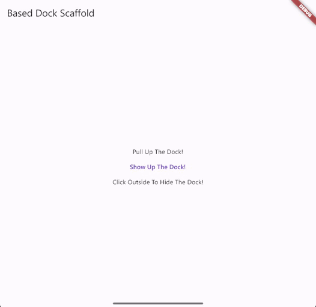

<div align="center">
  
  <p>『 based_dock_scaffold - Based Dock Scaffold! 』</p>
  <a href="https://github.com/Cierra-Runis/based_dock_scaffold/blob/master/README_zh.md">中文 Readme</a>
</div>

`Latest update: 2023-07-25 23:54:08`

[📚 Introduction](#-Introduction)

[📸 Screenshots](#-Screenshots)

[📦 How to use](#-How-to-use)

[⏳ Rate of progress](#-Rate-of-progress)

[📌 Cautions](#-Cautions)

[🧑‍💻 Contributor](#-Contributor)

[🔦 Declaration](#-Declaration)

---

# 📚 Introduction

A Based Dock Scaffold Widget, Which Helps You Create A Scaffold With A IPad-Like Dock

# 📸 Screenshots



# 📦 How to use

- Add `based_dock_scaffold` to your `pubspec.yaml`

```yaml
dependencies:
  flutter:
    sdk: flutter
  ...
  based_dock_scaffold: $latest_version
```

- See the example code at [example](https://github.com/Cierra-Runis/based_dock_scaffold/blob/master/example/lib/main.dart)

# ⏳ Rate of progress

Done, but it will revise if necessary

# 📌 Cautions

- **_DO NOT_** import any file below `src` folder:

```dart
import 'package:based_dock_scaffold/src/*.dart';
```

- Since `BasedDockScaffold` is actually **_NOT_** a `Scaffold`
  you should use `Scaffold.of(context)` to get `ScaffoldState`
  rather than `BasedDockScaffold.of(context)`

# 🧑‍💻 Contributor

<a href="https://github.com/Cierra-Runis/based_dock_scaffold/graphs/contributors">
  
</a>

# 🔦 Declaration

[](https://github.com/Cierra-Runis/based_dock_scaffold/blob/master/LICENSE)

This project is licensed under the terms of the `MIT` license. See [LICENSE](https://github.com/Cierra-Runis/based_dock_scaffold/blob/master/LICENSE) for more details
